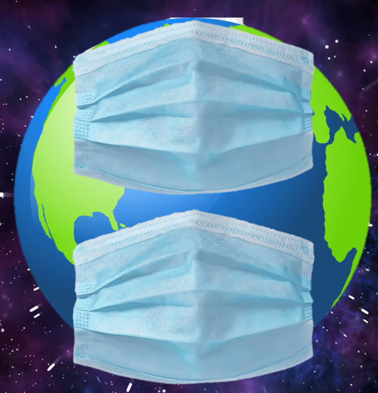

<!--
*** Thanks for checking out this README Template. If you have a suggestion that would
*** make this better, please fork the repo and create a pull request or simply open
*** an issue with the tag "enhancement".
*** Thanks again! Now go create something AMAZING! :D
***
***
***
*** To avoid retyping too much info. Do a search and replace for the following:
*** github_username, repo, twitter_handle, email
-->

<!-- PROJECT LOGO -->
<br />
<p align="center">
  <a href="https://github.com/peatear-anthony/abenomask">
    
  </a>

  <h3 align="center">GoNoKami</h3>

  <p align="center">
    App created for the Covid-19-SpaceApps Competition. 
    <br />
    <a href="https://covid19.spaceappschallenge.org/challenges/covid-challenges/isolation-solution/teams/abenomask/project"><strong>Project Page »</strong></a>
  <br />
  <a href="https://gonokami.herokuapp.com/"><strong>Website »</strong></a>
  </p>
</p>

<!-- TABLE OF CONTENTS -->
## Table of Contents

* [Getting Started](#getting-started)
  * [Installation](#installation)
* [Usage](#usage)


<!-- GETTING STARTED -->
## Getting Started
To get a local copy up and running follow these simple steps.

### Installation
 
1. Clone the repo
```sh
git clone https://github.com/peatear-anthony/abenomask.git
```
2. Install  packages
```sh
pip install -r requirments.txt
```
3. Run App
```sh
python run.py
```

<!-- USAGE EXAMPLES -->
## Usage
1. Input your information and create an account.

2. Login to your account.

3. You can see the list of near parks from your location. It shows the limit which shows how many people can go to the park, and how many people reserved. Press make reservation to reserve your schedule.

4. You cannot reserved full park which is indicated in red letters.

5. Input the date and time you want to go to the park, and press reserve.

6. You can check your reservation list if you press My Reservations in the navigation var.

7. You can cancel your reservation by pressing Cancel Reservation.

8. You can edit your profile and put your accont picture.

9. For the future prospect, we would like to improve our GUI like this.


